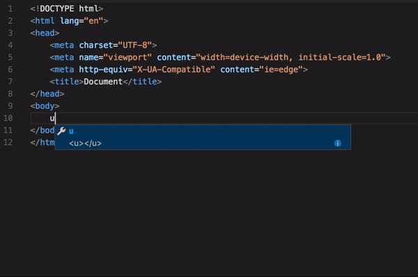

# Emmet plugin for [Visual Studio Code](https://code.visualstudio.com)

This is experimental alpha version of new Emmet plugin with limited features. 

- Expanded abbreviation show up in the suggestion list.
- Possible abbreviations show up in the sugestion list.
- TAB is no longer used for expanding emmet abbreviations. Instead the suggestion list is used.
- The below commands already available from the built in emmet in the product will be using this extension.
    - Emmet: Expand abbreviation
        - The selected text or the text preceeding the cursor if no text is selected is taken as the abbreviation to expand.
    - Emmet: Wrap with abbreviation
        - The selected text or the current line if no text is selected, is wrapped with given abbreviation. 
    - Emmet: Remove Tag
        - The tag under the cursor is removed along with the corresponding opening/closing tag. Works with multiple cursors.
    - Emmet: Update Tag
        - The tag under the cursor is updated to the given tag. Works with multiple cursors.
    - Emmet: Go to Matching Pair
        - Cursor moves to the tag matching to the tag under cursor. Works with multiple cursors. 

